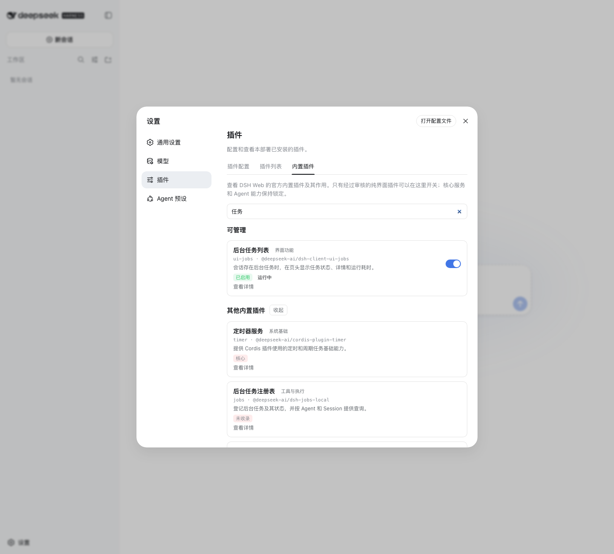

# dsh-builtin-toggles

DeepSeek Harness Web 的官方内置插件目录与安全开关。

> 非官方社区插件（unofficial community plugin）。与 DeepSeek Harness 官方无关，不受官方支持。



DSH Web 由大量官方内置插件（built-in entries）组成，但原始的 Loader id / package 名很难让普通用户判断每个插件是干什么的、当前是什么状态、为什么有些能关、有些不能。本插件在 **设置 → 插件 → 内置插件** 提供一个面向中文用户的内置插件目录与安全开关。

## 安装

前置：`dsh` CLI（≥ 0.1.0-rc.6，web profile 已初始化）。

```sh
dsh plugin --profile web add dsh-builtin-toggles
```

安装后需要重启 DSH web/gateway 才会首次加载（bundle 层在启动时读取）。

## 功能

- **中文官方内置插件目录**：为当前 Web Loader 中的官方内置插件提供中文名称、一句话说明和分类；展开卡片可查看“关闭后 / 建议”（可管理项）或“为什么锁定 / 状态说明”（锁定项）。
- **本地搜索**：按名称、功能、ID 或包名过滤全部条目，不请求网络。
- **Agent Preset 状态解释**：`tool-*` / `plan-mode` 等由 Agent Preset 按会话组装的能力，统一显示“由 Agent 预设管理”，不会误导为“功能已关闭”。
- **9 个经过审核的安全 UI 开关**：`ui-deliverables`、`ui-jobs`、`ui-goal`、`ui-message-feedback`、`ui-model-selection`、`ui-agent-preset`、`ui-skill`、`ui-subagent`、`ui-trajectory` —— 都是纯界面插件；开关立即生效于 Host 运行时并持久化到 profile patch，重启后保持。
- **其余插件 fail-closed 锁定**：核心服务、Agent 能力与未知条目一律锁定，不提供开关。

## 安全模型

可管理性完全来自 `src/policy.ts` 的精确显式 allowlist（`MANAGEABLE_IDS`），没有“名字看起来像 UI 所以允许”的启发式；服务端在每次开关请求时重新执行全部检查（allowlist、body 合法性、entry 存在、`@deepseek-ai/*` 包名、非插件自身），任何一条不满足都拒绝。UI 隐藏按钮不是安全边界。

目录（`src/client/catalog.zh.ts`）是纯展示层：条目没有 `manageable` / `enabled` / `disabled` / `allowToggle` / `policy` 字段，`PRESET_MANAGED_IDS` 也只是展示元数据——目录绝不参与授权。

## 兼容性

- Tested with DSH 0.1.0-rc.6（隔离 DSH_HOME + headless Chromium 真实浏览器验证）。
- 开关的运行时效果是 Host 侧**立即生效**；已打开的浏览器页面需要**刷新后**才应用 client-side 改变（rc.6 行为），切换成功后面板会提示“刷新页面后生效”。
- 持久化写入 profile 的 `cordis.patch.yml`，重启后保持。

## 卸载

```sh
dsh plugin --profile web remove dsh-builtin-toggles
```

然后重启。本插件写入的 `disabled` override 会保留在 profile patch 中（可手动清理）。

## 开发

```sh
pnpm install
pnpm typecheck
pnpm test
pnpm build     # tsdown → lib/index.js (node ESM) + lib/client.js (browser bundle)
```

## License

MIT。
